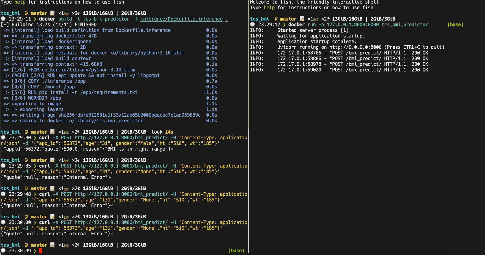

# BMI Predictor API server
## Model specification
The predictive model is a gradient boosted decision tree predictor trained on a synthetic data set, which is derived from the provided `Dummy-Data.csv` and further enriched using synthetic generation based on the business rules described in documentation. Please see [exploratory notebook](https://github.com/nilbot/shiny-computing-machine-bmi/blob/master/exploratory/experiment.ipynb) for the detail information. 

The model in deployment (this app)  
## App specification
The app assumes same input specification as the provided sample csv data. Namely with following values:
```
original csv labels:
AppID Ins_Age Ins_Gender Ht Wt Issue_Date

new json keys:
app_id age gender ht wt issue_date

example:
{"app_id":"56372","age":"31","gender":"Male","ht":"510","wt":"185", "issue_date":"2000-01-01"}
```
The app will parse the values and transform `Ht`, `Wt` using rules described in documentation and pass over the 3 resulting variables `age`, `gender` and `bmi` to the model. The model predict a bmi classification and output quote and reason according the business rules, in the format of json object. 

The app serves on `:8000` via `/bmi_predict/` endpoint. 

### Example input and output:

in command line

 `curl -X POST http://127.0.0.1:8000/bmi_predict/ -H 'Content-Type: application/json' -d '{"app_id":"56372","age":"31","gender":"Male","ht":"510","wt":"185"}'`

returns 

 `{"appid":56372,"quote":500.0,"reason":"BMI is in right range"}`


## Deployment with Docker

1. step in project folder: `cd <project_root>`
2. build docker using `docker build -t <my_bmi_prediction_docker_image_tag> -f $(pwd)/inference/Dockerfile.inference .`
3. (optional) push the image to repository
4. running docker with `docker run -p 8000:8000 <my_bmi_prediction_docker_image_tag>`, preferably with systemd
5. (depending on environments and need) reverse proxy up and serve 


## Screenshot



## Further Improvements

First of all, this is a quick and dirty implementation of predictor model, we haven't look into operational potentials other than single shot REST API calls. (Even though a cli version based on existing code is trivial, we omit the cli operational mode as it is almost identical to REST version)

The model is trained using python `scikit-learn` (and `lightgbm`), both framework prefer batched input (because of `numpy`), which is not designed to be run as rapid-fire REST API service. One potential upgrade from this is to use `ONNX` format and deploy the model on `ONNX` machine learning platforms, if such platforms are available. Alternatively, one could avail for GCP and Microsoft Azure's Machine Learning cloud offering for serving models, they all support scikit-learn models out of the box.

Further, model was investigated and trained on the assumption that this was to learn the given business rules, therefore original dataset was not directly used for training the model, since the distribution present imbalanced labels. Still, the generated dataset is still small (less than 300 samples), and the result model is rudimentary (barely above 90% accuracy). Further improvement in the performance should be saught, should the time permit. 
